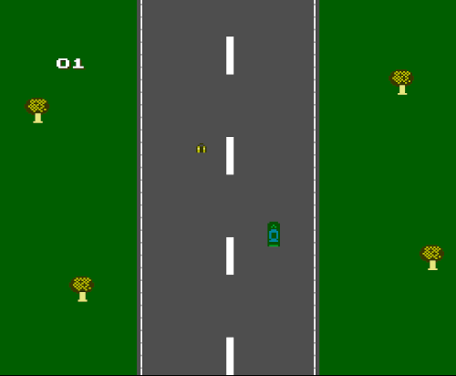

# Description

A game written in pure cc65 mos6501 assembly for the Nintendo entertainment system. (nes)

Goal of the game is to collect 20 pieces of luggage in order to unlock the secret screen. This game is part of a bigger ARG puzzle that I have designed for some of my friends.

I always wanted to learn how games are developed for the old consoles, and also in modern computing I never had a good excuse to make something in pure assembly, so that's why I decided to make this game as a hobby project and programming exercise.

# How to play?

The rom file is pre-compiled in this repository, and should play in any nes emulator. I used FCEUX in Wine while developing.

# How to compile

Install cc65 somewhere on your machine, edit the compile.sh file to point to the binary for your cc65 compiler, and execute the compile.sh script in order to complile.

# Screenshot

